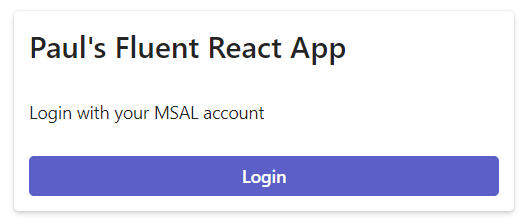
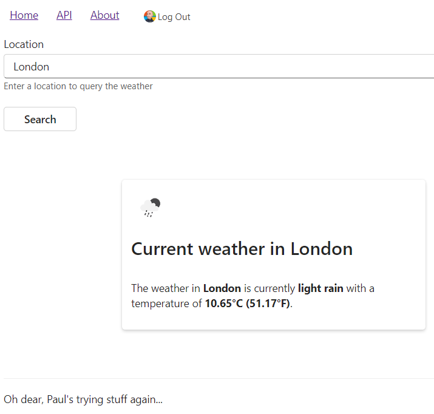

# React + Vite + MSAL + MS Graph + Fluent UI
Paul is trying to learn how to use React Vite, MSAL, MS Graph, and Fluent UI in an app that can query an external API and display the results on the page.

## Use
- Upon visiting the site, you will be faced with the login screen:   
   

- After logging in with your MS corp account, you will get a personalised welcome
    - Your `givenName` is obtained from MS Graph
    - Your profile picture shown beside the **Log Out** button is also obtained from MS Graph   
   

- In the **API** tab, you can enter a town or city name and hit **Enter** or press the **Submit** button. Doing so will update the card displaying the current weather and an appropriate weather icon.
    - The results come from querying an external weather API.
    - The icon will also be updated based on the weather response.
    - The card demonstrates the `Card` container from Fluent UI.   
   

- From the **About** tab, you can see the a *ahem* clearly accurate contact card using `Persona` component from Fluent UI   
